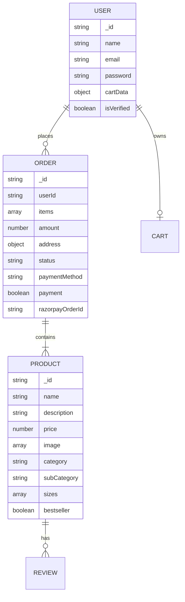

# Wobblix: API & Database Specification

## 1. Database Schema (ERD)

Wobblix uses MongoDB with a relational-style document modeling approach.

### Table Mapping

| Collection | Purpose | Key Fields |
|------------|---------|------------|
| **Users** | Identity & Auth | `email`, `password`, `isVerified` |
| **Products** | Inventory Data | `name`, `price`, `category`, `sizes` |
| **Orders** | Transaction History | `userId`, `items`, `payment`, `status` |

---

## 2. API Documentation

Base URL: `http://localhost:4000/api`

### Authentication & User

| Method | Endpoint | Purpose | Auth Required |
|--------|----------|---------|---------------|
| POST | `/user/register` | Create new account (sends OTP) | No |
| POST | `/user/login` | Authenticate user & return JWT | No |
| POST | `/user/verify` | Verify email with OTP | No |
| GET | `/user/profile` | Get current user data | Yes (token) |

### Products

| Method | Endpoint | Purpose | Auth Required |
|--------|----------|---------|---------------|
| GET | `/product/list` | Fetch all products with filters | No |
| GET | `/product/single` | Fetch details for one product | No |
| POST | `/product/add` | (Admin) Add new product | Yes (Admin) |
| POST | `/product/remove` | (Admin) Delete product | Yes (Admin) |

### Cart

| Method | Endpoint | Purpose | Auth Required |
|--------|----------|---------|---------------|
| POST | `/cart/add` | Add item to cart | Yes (token) |
| POST | `/cart/update` | Change quantity/size | Yes (token) |
| POST | `/cart/get` | Fetch user's active cart | Yes (token) |

### Orders & Payments

| Method | Endpoint | Purpose | Auth Required |
|--------|----------|---------|---------------|
| POST | `/order/razorpay` | Initialize Razorpay Order | Yes (token) |
| POST | `/order/verifyRazorpay`| Verify Payment Signature | Yes (token) |
| GET | `/order/list` | (Admin) List all orders | Yes (Admin) |
| POST | `/order/userorders` | List user's paid orders | Yes (token) |
| POST | `/order/status` | (Admin) Update status/tracking | Yes (Admin) |

---

## 3. Security Implementation

- **JWT (JSON Web Tokens)**: All protected routes require a `token` header.
- **HMAC Signature**: Razorpay payments are verified on the server side using the `RAZORPAY_KEY_SECRET`.
- **Input Validation**: `express-mongo-sanitize` prevents NoSQL injection.
- **XSS Protection**: `xss-clean` filters all incoming strings.
- **CORS Configuration**: Restricts access to specific frontend origins (Wobblix main + Admin).
