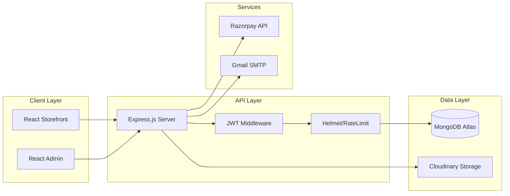
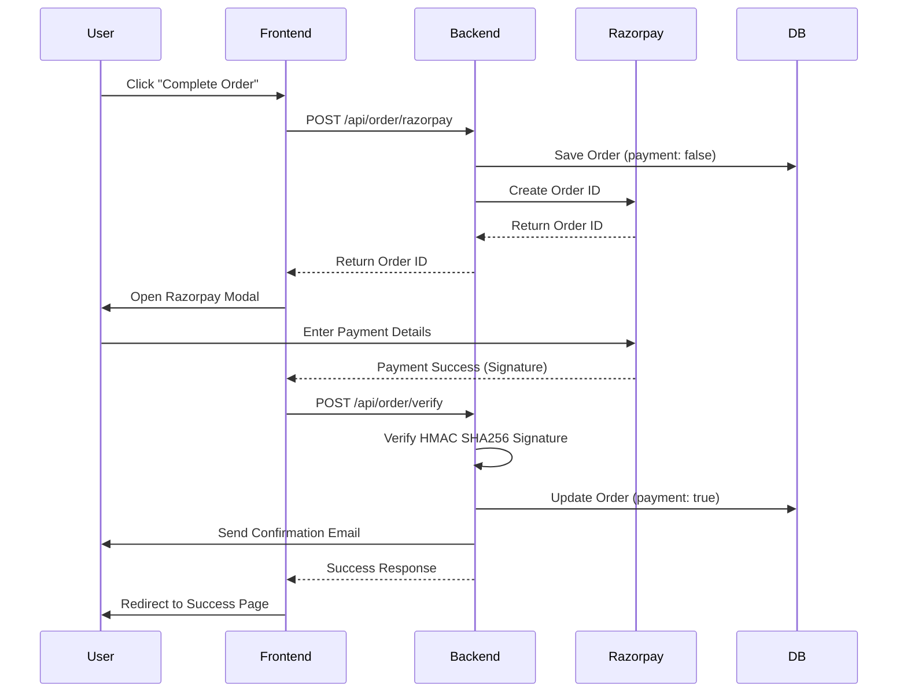

# Wobblix: Technical Architecture & System Design

## 1. High-Level Architecture

Wobblix follows a **Client-Server Architecture** using the MERN stack. It is designed for horizontal scalability and high availability by utilizing managed services like MongoDB Atlas and Cloudinary.

### System Components Diagram

---

## 2. Request Lifecycle

1. **Client Interaction**: User triggers an action (e.g., adding to cart).
2. **State Management**: `ShopContext` updates local state instantly for perceived speed.
3. **API Request**: Axios sends an authenticated request (JWT in headers) to the Node server.
4. **Middleware Pipeline**:
    - **Helmet**: Secures headers.
    - **Rate Limiter**: Checks IP frequency.
    - **Sanitizers**: Cleans NoSQL and XSS payloads.
    - **Auth**: Verifies JWT.
5. **Controller Logic**: Handler processes business logic (e.g., inventory check).
6. **Persistence**: Mongoose saves data to MongoDB.
7. **Response**: Clean JSON response sent back to client.

---

## 3. Data Flow: Order Placement

The order flow is the most complex part of the system, involving multi-step verification.

---

## 4. Frontend Design Patterns

- **Context API (Provider Pattern)**: Used in `ShopContextProvider` to avoid prop-drilling for core data like `cartItems`, `products`, and `userData`.
- **Atomic Components**: Small, reusable UI elements like `Title.jsx`, `CartTotal.jsx`, and `ProductItem.jsx`.
- **Higher-Order Wrappers**: `PageWrapper.jsx` manages global animations (Framer Motion) and layout consistency.
- **Custom Hooks**: Efficiently manages lifecycle events like search and filtering.

---

## 5. Deployment Strategy

Wobblix is configured for automated CI/CD:
- **Frontend/Admin**: Vercel (Edge Network) for sub-second global delivery.
- **Backend**: Render/Railway for managed Node.js environments.
- **Images**: Cloudinary (Image CDN) for dynamic resizing and format optimization (WebP/AVIF).

---

## 6. Scaling Roadmap

### Phase 1: 1k - 10k Users
- Implement **Redis Caching** for the `/api/product/list` endpoint.
- Add **Database Indexing** on `category` and `subCategory`.

### Phase 2: 100k+ Users
- **Read Replicas**: Separate read/write database traffic.
- **Microservices**: Decouple the `OrderService` and `EmailService` into independent Lambda functions.
- **Load Balancing**: Use Nginx or AWS ALB to distribute traffic across multiple backend instances.
