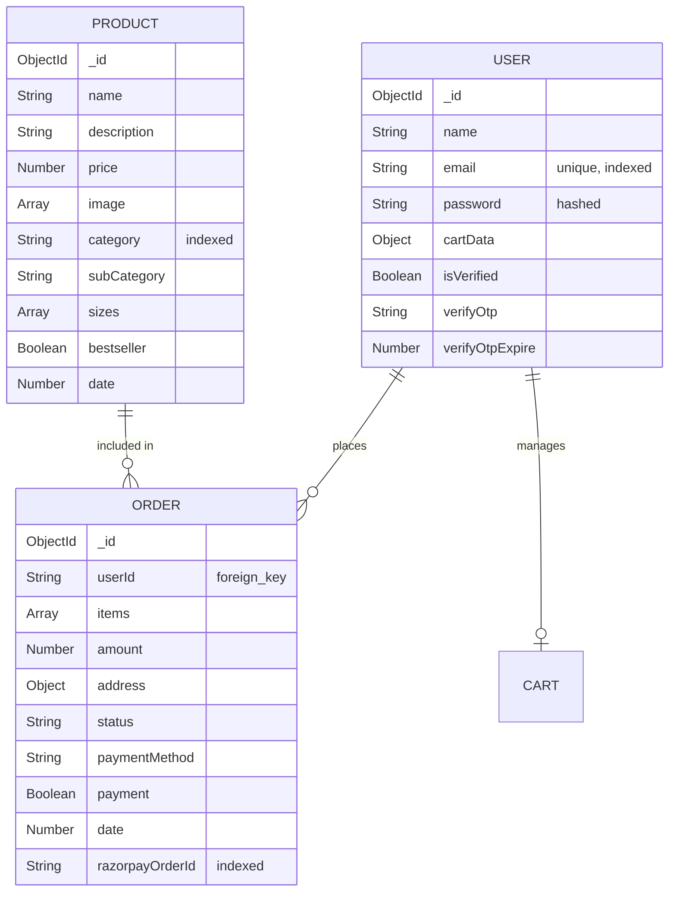

# Wobblix: Database Design & Data Modeling

## 1. Entity Relationship Diagram (ERD)

Wobblix uses a document-oriented approach that preserves relational integrity for critical transaction paths.

---

## 2. Collection Specifications

### User Collection
- **Indexing**: `email` is indexed for O(1) lookups during login.
- **Security**: The `password` field is excluded by default in profile queries (`.select("-password")`).

### Product Collection
- **Atomic Updates**: Uses `$set` and `$push` for modifying inventory.
- **Query Optimization**: Products are sorted by `date: -1` in the `getProductsData` logic for "Latest Collections" speed.

### Order Collection
- **Normalization**: Instead of linking, we **embed** product snapshots (name, price, image) at the time of purchase. 
- **Reasoning**: If a product price changes or a product is deleted, the historical order record remains accurate. This is an industry-standard "E-commerce Snapshot" pattern.

---

## 3. Data Lifecycle & Retention

1. **Cart Persistence**: Cart data is stored both in the User document and local storage, ensuring cross-device synchronization.
2. **Order Integrity**: Orders start as `payment: false`. A background verification service (Razorpay Signature) moves them to `payment: true`.
3. **Soft Cleanup**: Unverified users or expired OTPs can be cleared via TTL (Time To Live) indexes or periodic cron jobs.

---

## 4. Scalability Strategy

- **Read Replicas**: MongoDB Atlas allows for geographic distribution of read-only nodes to reduce latency for product listing.
- **Horizontal Sharding**: As the order volume grows, the `Order` collection can be sharded by `userId` to distribute write pressure across multiple clusters.
