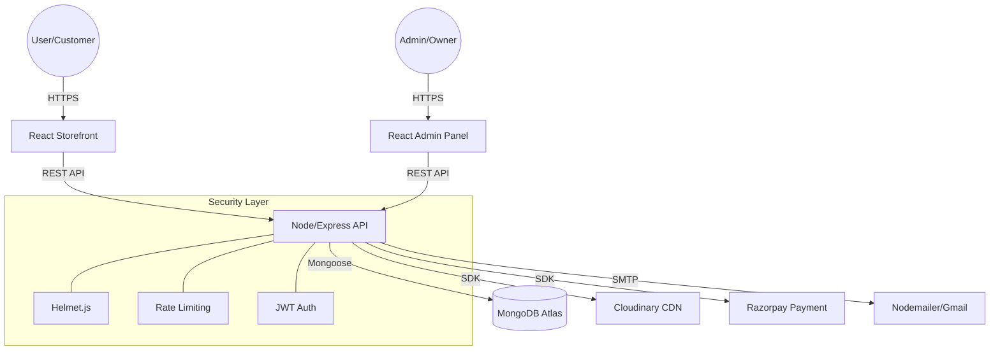

# Wobblix: The Ultimate Streetwear E-Commerce Ecosystem

[](https://mongodb.com)
[](https://reactjs.org)
[](https://nodejs.org)
[](https://razorpay.com)
[](#)

Wobblix is a high-performance, full-stack e-commerce ecosystem specifically engineered for the Gen Z streetwear market. It combines a brutalist-minimalist design aesthetic with a robust MERN architecture, providing a seamless, high-conversion shopping experience.

---

## 📖 Table of Contents
1. [Project Overview](#1-project-overview)
2. [Executive Summary](#2-executive-summary)
3. [Tech Stack Breakdown](#3-tech-stack-breakdown)
4. [Folder Structure Analysis](#4-folder-structure-analysis)
5. [System Architecture](#5-system-architecture)
6. [Security & Performance](#6-security--performance)
7. [API & Database](#7-api--database)
8. [Business Architecture](#8-business-architecture)
9. [Documentation Index](#9-documentation-index)

---

## 1. Project Overview

### What is Wobblix?
Wobblix is more than just a store; it's a production-ready retail engine. It solves the fragmentation problem in modern streetwear drops by integrating content (video carousels), commerce (dynamic cart), and community (reviews) into a single, cohesive unit.

### Core Problem Solved
Traditional e-commerce platforms often feel slow, cluttered, and disconnected from the brand's aesthetic. Wobblix solves this by offering:
- **Instant Visual Engagement**: High-speed video carousels and motion-heavy UI.
- **Conversion Optimization**: A streamlined 3-step checkout process integrated with Razorpay.
- **Operational Efficiency**: A dedicated Admin Dashboard for inventory and order management.

### Unique Selling Points (USP)
- **Brutalist Peak Design**: Custom UI/UX inspired by premium streetwear brands.
- **Razorpay Precision**: 100% reliable payment verification using HMAC SHA256 signatures.
- **SEO Mastery**: Dynamic metadata management via `react-helmet-async` for every product.

---

## 2. Executive Summary

### 🚀 Startup Pitch
Wobblix is the Shopify-killer for niche streetwear brands. We provide the performance of a custom-built solution with the ease of a SaaS, focusing on high-conversion visual storytelling.

### 🛡️ CTO Perspective
The architecture follows a strict **Separation of Concerns (SoC)**. The frontend is a highly reactive SPA, the backend is a stateless REST API secured with a comprehensive security suite (Helmet, Rate Limiting, Sanitization), and the database is a flexible NoSQL schema optimized for rapid scaling.

### 🏛️ Architect Perspective
Wobblix utilizes a **Layered Architecture**. The backend is divided into Controllers (Business Logic), Models (Data Schema), and Routes (Entry Points). The frontend uses **Context API** for global state management, ensuring a single source of truth for cart and user data.

---

## 3. Tech Stack Breakdown

| Category | Technology | Why Used | Benefits |
|----------|------------|----------|----------|
| **Frontend** | React 18 (Vite) | High performance, HMR, Component-based | Rapid UI development, sub-second loads |
| **Backend** | Node.js / Express | Non-blocking I/O, vast ecosystem | Scalable concurrent requests |
| **Database** | MongoDB / Mongoose | Flexible schema, JSON-native | Fast iteration, easy data modeling |
| **Security** | Helmet.js | Prevents 11+ security vulnerabilities | Enterprise-grade HTTP security |
| **Payments** | Razorpay SDK | Trusted in India, robust API | High success rates, secure verification |
| **Motion** | Framer Motion | Industry standard for animations | Smooth, premium user experience |
| **Styling** | Tailwind CSS | Utility-first, rapid prototyping | Tiny CSS bundle, consistent design |
| **Images** | Cloudinary | Auto-optimization, CDN delivery | Fast image loading across devices |

---

## 4. Folder Structure Analysis

```text
wobblix/
├── frontend/             # Customer-facing Storefront
│   ├── src/
│   │   ├── components/   # Atomic & Molecular UI components
│   │   ├── pages/        # Route-level views (Home, Product, Cart)
│   │   ├── context/      # ShopContext (Global State)
│   │   └── assets/       # Visual media & styles
├── admin/                # Internal Management Portal
│   ├── src/
│   │   ├── pages/        # Dashboard, Add Product, Order List
│   │   └── components/   # Admin UI elements
└── backend/              # Core API Service
    ├── controllers/      # Request handlers & Business Logic
    ├── models/           # Mongoose schemas (User, Product, Order)
    ├── routes/           # API Endpoint definitions
    ├── middleware/       # Auth, Security, Error Handling
    └── utils/            # Helper services (Email, Razorpay)
```

---

## 5. System Architecture (Mermaid)



---

## 6. Documentation Index

For deep-dives into specific architectural areas, please refer to the following documents:

| Document | Purpose |
|----------|---------|
| [ARCHITECTURE.md](./ARCHITECTURE.md) | High-level system design and infrastructure details. |
| [API_DOCUMENTATION.md](./API_DOCUMENTATION.md) | Full endpoint map, request/response schemas. |
| [DATABASE_DESIGN.md](./DATABASE_DESIGN.md) | ER diagrams and data relationship mappings. |
| [SECURITY_AUDIT.md](./SECURITY_AUDIT.md) | Security implementations and vulnerability analysis. |
| [SYSTEM_DESIGN.md](./SYSTEM_DESIGN.md) | Low-level design (LLD) and state management flow. |
| [BUSINESS_ANALYSIS.md](./BUSINESS_ANALYSIS.md) | Market fit, ROI, and product scaling roadmap. |
| [INTERVIEW_GUIDE.md](./INTERVIEW_GUIDE.md) | FAANG-level project walkthrough and STAR answers. |

---

## 🛠️ Installation & Setup

1. **Clone the repository**
2. **Setup Backend**: `cd backend && npm install` -> Configure `.env`
3. **Setup Frontend**: `cd frontend && npm install` -> Configure `.env`
4. **Setup Admin**: `cd admin && npm install` -> Configure `.env`
5. **Run Locally**: `npm run server` (Backend) & `npm run dev` (Frontend/Admin)

---

Developed with ❤️ by the Wobblix Engineering Team.
