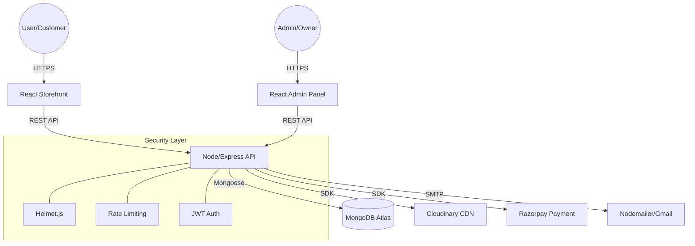

# Wobblix: The Ultimate Streetwear E-Commerce Ecosystem

[](https://mongodb.com)
[](https://reactjs.org)
[](https://nodejs.org)
[](https://razorpay.com)
[](#)

Wobblix is a high-performance, full-stack e-commerce ecosystem specifically engineered for the Gen Z streetwear market. It combines a brutalist-minimalist design aesthetic with a robust MERN architecture, providing a seamless, high-conversion shopping experience.

---

## 📖 Table of Contents
1. [Project Overview](#1-project-overview)
2. [Recent Architectural Upgrades (New)](#recent-architectural-upgrades-new)
3. [Tech Stack Breakdown](#3-tech-stack-breakdown)
4. [Folder Structure Analysis](#4-folder-structure-analysis)
5. [System Architecture](#5-system-architecture)
6. [Ecosystem Scaling Roadmap](#ecosystem-scaling-roadmap)
7. [Security & Performance](#7-security--performance)
8. [Documentation Index](#8-documentation-index)
9. [🛠️ Installation & Setup](#%EF%B8%8F-installation--setup)

---

## 1. Project Overview

### What is Wobblix?
Wobblix is more than just a store; it's a production-ready retail engine. It solves the fragmentation problem in modern streetwear drops by integrating content (video carousels), commerce (dynamic cart), and community (reviews) into a single, cohesive unit.

### Core Problem Solved
Traditional e-commerce platforms often feel slow, cluttered, and disconnected from the brand's aesthetic. Wobblix solves this by offering:
- **Instant Visual Engagement**: High-speed video carousels and motion-heavy UI.
- **Conversion Optimization**: A streamlined 3-step checkout process integrated with Razorpay.
- **Operational Efficiency**: A dedicated Admin Dashboard for inventory and order management.

---

## Recent Architectural Upgrades (New)

Recently, the codebase was refactored to support scaling product collections and custom design configurations:

1. **Single-Choice Subcategory & Trousers Release**:
   - Added `"Trousers"` as a first-class subcategory options dropdown.
   - Fully integrated the `cat_joggers` visual asset onto the Home page styles selection list.
   - Kept subcategory selection as a clean, single-choice selector for rigid product classifications.

2. **Multi-Select Design Tags**:
   - Modified the `design` field in the database from a single `String` to an array of strings (`[String]`).
   - Upgraded the Admin **Add Product** and **Edit Product** interfaces to replace the dropdown list with dynamic multiple-choice pills, allowing admins to apply multiple tags (e.g. `["Anime", "Summers"]`) to a single product.
   - Refactored frontend filtering in `Collection.jsx` to perform high-performance array intersection matching using `item.design.some(...)` against selected filters.

3. **Favicon Configuration & Recapture Title Animations**:
   - Implemented the custom brand logo `logo.png` inside the `public` directories of both the `frontend` and `admin` panels.
   - Added a visibility-change tab animation listener: when the user switches away from the Wobblix tab, the browser title animates every 1.8 seconds between recapture messages (`"Come back! 😢"`, `"We miss you! ❤️"`, `"New drops waiting! 🔥"`). When returning, the page title instantly restores back to the original page title.

---

## 3. Tech Stack Breakdown

| Category | Technology | Why Used | Benefits |
|----------|------------|----------|----------|
| **Frontend** | React 18 (Vite) | High performance, HMR, Component-based | Rapid UI development, sub-second loads |
| **Backend** | Node.js / Express | Non-blocking I/O, vast ecosystem | Scalable concurrent requests |
| **Database** | MongoDB / Mongoose | Flexible schema, JSON-native | Fast iteration, easy data modeling |
| **Security** | Helmet.js | Prevents 11+ security vulnerabilities | Enterprise-grade HTTP security |
| **Payments** | Razorpay SDK | Trusted in India, robust API | High success rates, secure verification |
| **Motion** | Framer Motion | Industry standard for animations | Smooth, premium user experience |
| **Styling** | Tailwind CSS | Utility-first, rapid prototyping | Tiny CSS bundle, consistent design |
| **Images** | Cloudinary | Auto-optimization, CDN delivery | Fast image loading across devices |

---

## 4. Folder Structure Analysis

```text
wobblix/
├── frontend/             # Customer-facing Storefront
│   ├── public/           # Public static assets (logo.png, robots, sitemaps)
│   ├── src/
│   │   ├── components/   # Atomic UI components (Categories, ProductItem, HoodieCollection)
│   │   ├── pages/        # Route-level views (Home, Product, Cart, Collection)
│   │   ├── context/      # ShopContext (Global State & Promo/B4G1 calculations)
│   │   ├── utils/        # Image optimization & API helpers
│   │   └── assets/       # Brand visual media
│   └── index.html        # Entry HTML with tab title switch animation script
├── admin/                # Internal Management Portal
│   ├── public/           # Static assets (logo.png favicon)
│   ├── src/
│   │   ├── pages/        # Dashboard, Add Product, Edit Product, Order List
│   │   └── components/   # Admin side layout elements
│   └── index.html        # Admin entry HTML with tab recapturing script
└── backend/              # Core API Service
    ├── controllers/      # Request handlers (productController, orderController)
    ├── models/           # Mongoose schemas (User, productModel, Order)
    ├── routes/           # Express router endpoints
    ├── middleware/       # JWT Auth, security, and multer image parsers
    └── utils/            # Helper services (Email confirmation, Razorpay SDK)
```

---

## 5. System Architecture (Mermaid)


```mermaid
graph TD
    User((User/Customer)) -->|HTTPS| Storefront[React Storefront]
    Admin((Admin/Owner)) -->|HTTPS| AdminPanel[React Admin Panel]
    
    Storefront -->|REST API| Backend[Node/Express API]
    AdminPanel -->|REST API| Backend
    
    Backend -->|Mongoose| DB[(MongoDB Atlas)]
    Backend -->|SDK| Cloudinary[Cloudinary CDN]
    Backend -->|SDK| Razorpay[Razorpay Payment]
    Backend -->|SMTP| Mailer[Nodemailer/Gmail]
    
    subgraph Security Layer
        Backend --- Helmet[Helmet.js]
        Backend --- Limiter[Rate Limiting]
        Backend --- JWT[JWT Auth]
    end
```

---

## Ecosystem Scaling Roadmap

As Wobblix grows, the architecture is designed to scale horizontally across servers, database tiers, and edge layers:

### 1. Database Tier & Indexing
- **Current Scaling**:
  - Indexed keys in `productModel.js` for `category`, `subCategory`, and `design` tags, keeping queries at $O(1)$ complexity.
  - Using `$in` query matching in MongoDB for array-based filter tags to allow querying multiple tag choices in a single network trip.
- **Future Scale**:
  - **Database Sharding**: Share the workload by partitioning databases by `category` (e.g. Men's products vs Unisex products on separate shards).
  - **Read Replicas**: Deploy read-only MongoDB replicas to scale product listing operations independently of write transactions (product additions/edits).

### 2. Edge Caching & API Performance
- **Future Scale**:
  - **Redis Caching**: Cache hot API endpoints (like `/api/product/list`) in Redis. Evict the cache dynamically whenever a product is added, updated, or removed by an admin.
  - **CDN Distribution**: Serve the compiled React `frontend` and `admin` portals on global CDN systems (Vercel/Cloudflare Edge) to cache static pages close to the customer.

### 3. Server Architecture (Microservices)
- **Future Scale**:
  - **Decoupled Services**: Split the monolithic Express backend into isolated microservices:
    - `Product Service` (reads/writes to product model)
    - `Order & Checkout Service` (integrates with Razorpay and manages state)
    - `User & Cart Service` (stores sessions and cart logs)
  - **Message Queues**: Integrate RabbitMQ or Kafka to dispatch emails (such as order confirmation emails) asynchronously so that main thread execution is never blocked.

---

## 7. Security & Performance

- **HMAC Signatures**: 100% reliable payment verification using HMAC SHA256 signatures to prevent pricing or payment status tampering.
- **Lazy Loading**: Lazy loaded grids in the storefront with image scaling query variables powered by Cloudinary to reduce bandwidth consumption.
- **Rate Limiting**: Prevent scraping of product catalogues and brute-forcing authentication routes.

---

## 8. Documentation Index

For deep-dives into specific architectural areas, please refer to the following documents:

| Document | Purpose |
|----------|---------|
| [ARCHITECTURE.md](./ARCHITECTURE.md) | High-level system design and infrastructure details. |
| [API_DOCUMENTATION.md](./API_DOCUMENTATION.md) | Full endpoint map, request/response schemas. |
| [DATABASE_DESIGN.md](./DATABASE_DESIGN.md) | ER diagrams and data relationship mappings. |
| [SECURITY_AUDIT.md](./SECURITY_AUDIT.md) | Security implementations and vulnerability analysis. |
| [SYSTEM_DESIGN.md](./SYSTEM_DESIGN.md) | Low-level design (LLD) and state management flow. |
| [BUSINESS_ANALYSIS.md](./BUSINESS_ANALYSIS.md) | Market fit, ROI, and product scaling roadmap. |
| [INTERVIEW_GUIDE.md](./INTERVIEW_GUIDE.md) | FAANG-level project walkthrough and STAR answers. |

---

## 🛠️ Installation & Setup

1. **Clone the repository**
2. **Setup Backend**: `cd backend && npm install` -> Configure `.env`
3. **Setup Frontend**: `cd frontend && npm install` -> Configure `.env`
4. **Setup Admin**: `cd admin && npm install` -> Configure `.env`
5. **Run Locally**: `npm run server` (Backend) & `npm run dev` (Frontend/Admin)

---

Developed with ❤️ by the Wobblix Engineering Team.
