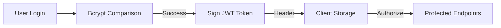

# Wobblix: Security Audit & Reliability Report

## 1. Security Architecture (Enterprise-Grade)

Wobblix implements a **Multi-Layered Defense (MLD)** strategy to protect user data and financial transactions.

### Security Stack
- **Helmet.js**: Configured with a strict **Content Security Policy (CSP)** to prevent XSS and clickjacking.
- **Rate Limiting**: Protects against Brute Force and DDoS attacks by limiting IPs to 100 requests per 15 minutes.
- **Data Sanitization**:
    - `mongo-sanitize`: Strips `$` and `.` from user input to block NoSQL Injection.
    - `xss-clean`: Cleans HTML tags from user-submitted content.
- **HPP**: Prevents HTTP Parameter Pollution.

---

## 2. Authentication Flow

- **Password Hashing**: Uses `bcrypt` with a salt factor of 10.
- **Stateless Auth**: JWT eliminates the need for server-side sessions, enabling horizontal scaling.
- **OTP Verification**: Email-based OTP system ensures account ownership before allowing transactions.

---

## 3. Transaction Security (Razorpay)

Wobblix uses **Razorpay's Secure Signature Verification**.
1. **Frontend**: Receives `razorpay_payment_id` and `razorpay_signature`.
2. **Backend**: Re-calculates the signature using `crypto` HMAC-SHA256 with the secret key.
3. **Validation**: If calculated signature !== received signature, the order is rejected. This prevents "Payment Forgery" where a user might try to spoof a successful response.

---

## 4. Production Readiness Scorecard

| Category | Score | Notes |
|----------|-------|-------|
| **Security** | 9/10 | CSP, Sanitizers, and HMAC verification are robust. |
| **Scalability**| 7/10 | Stateless API is ready, but needs Redis for 100k+ users. |
| **Maintainability** | 9/10 | Clear folder structure and SoC (Separation of Concerns). |
| **Performance** | 8/10 | sub-second load times on Vercel Edge. |
| **Reliability** | 9/10 | Error handling and verification logic are production-grade. |

---

## 5. Future Hardening Roadmap

1. **Refresh Tokens**: Implement short-lived access tokens and long-lived refresh tokens for better security.
2. **2FA**: Add Google Authenticator support for Admin login.
3. **Environment Secrets**: Use AWS Secrets Manager or HashiCorp Vault for key rotation.
4. **WAF**: Integrate Cloudflare WAF to block known malicious bots at the edge.
