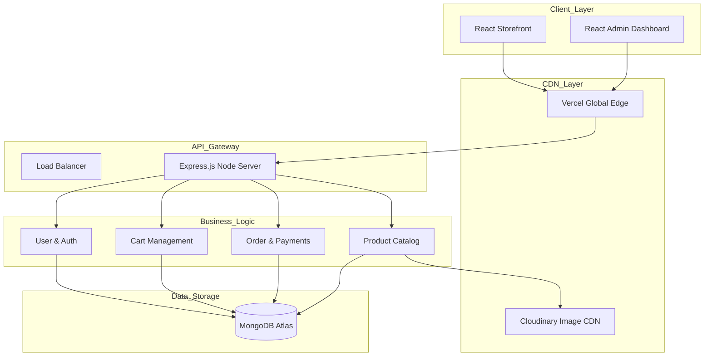

# Wobblix: High-Level System Design (HLD)

## 1. Design Philosophy
Wobblix is designed as a **Stateless Distributed System**. Every component is decoupled to allow for independent scaling and maintenance.

### 2. High-Level Architecture Diagram

---

## 3. Communication Patterns

### Synchronous (REST API)
- User Login / Registration
- Cart Updates
- Real-time Order Verification

### Asynchronous (Internal)
- Email Notifications (via Nodemailer)
- Image Processing (via Cloudinary upload handlers)

---

## 4. Key Design Decisions

### 1. Stateless Authentication (JWT)
**Decision**: Use JWT over Session-based auth.
**Reasoning**: Allows the backend to scale horizontally across multiple instances without needing a shared session store (like Redis) initially.

### 2. Schema-less Flexibility (MongoDB)
**Decision**: NoSQL over SQL.
**Reasoning**: Streetwear products have fluid attributes (drops, collections, limited instructions). MongoDB handles these dynamic fields without rigid migrations.

### 3. Edge Delivery (Vercel)
**Decision**: Hosting the frontend on Vercel.
**Reasoning**: Ensures the heavy media content (videos/images) is delivered from the closest geographic node to the user.

---

## 5. Failure & Resilience

- **Graceful Failover**: If the backend is down, the frontend uses a "Backend Warmup" hook to check status and provide a user-friendly "Maintenance Mode" if needed.
- **Data Validation**: Every API request is validated using `validator` and Mongoose middleware to ensure zero data corruption.
- **Payment Verification**: Dual-verification (Frontend + Backend Signature) ensures 100% financial integrity even if the client-side browser is compromised.
